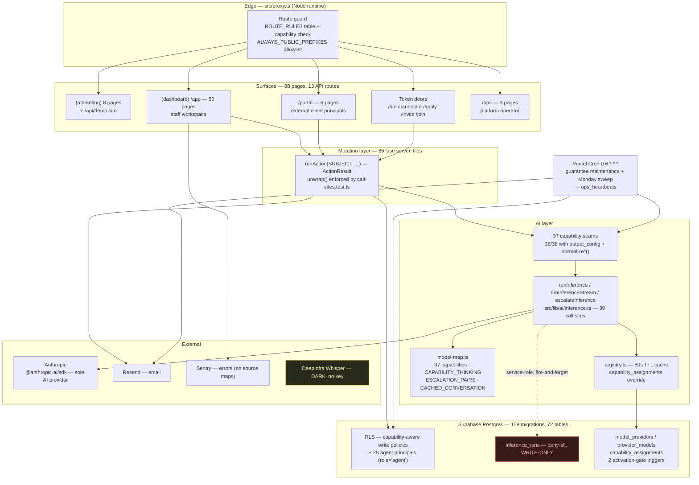

# MANDATE — PRODUCT AND ENGINEERING ASSESSMENT — 2026-10-07

**Assessment date:** 2026-10-07
**Assessed by:** architecture / product review pass, implementation-first
**Scope:** whole application — local working tree, live database, production deployment
**Nothing was changed.** No code, no schema, no dependency, no commit, no deploy. The
working tree is exactly as found (38 modified files, 2 untracked) and all four green-gate
checks were run read-only.

A note on method, because it changes how to read this document. Documentation and prior
session summaries were treated as *claims to verify*, not evidence. Where a document and
the implementation disagree, the implementation wins and the disagreement is recorded as a
finding. Four items the repo's own checklist calls open are in fact closed, and two items
it calls closed are in fact open. Both directions are reported.

---

## 0. ADDENDUM — COMMERCIAL, PRIVACY AND INFRASTRUCTURE READINESS (added 2026-10-07, same day)

This assessment was extended the same day to cover commercial readiness, privacy and
contractual preparation, and infrastructure recovery. **Five companion documents** were
produced; this section records what they changed in the findings above.

| Document | Covers |
|---|---|
| `../legal/2026-10-07-factual-annexes.md` | 12 factual annexes for the legal pack — the verified substrate a lawyer needs |
| `../legal/drafts/` | 5 **labelled review drafts**: terms, two privacy notices, DPA, subprocessors. None approved or published |
| `../commercial/2026-10-07-launch-offer-and-promise-audit.md` | 4 launch stages, audit of all 21 published promises, corrected copy for review, first-client offer definition, billing vs entitlements |
| `../infrastructure/2026-10-07-recovery-plan.md` | Verified plan state, recommended configuration, cost, restore procedure, 11 steps for approval |
| `../enterprise/2026-10-07-buyer-requirements-matrix.md` | Enterprise buyer matrix — implemented / verified / absent / unknown |
| `2026-10-07-go-no-go.md` | **Per-segment release verdict across 7 dimensions** |

### 0.1 Findings that CHANGE the body of this assessment

**§1.3 item 1 and §8.3 A-items are superseded in severity by the following.** The
infrastructure risk was understated as "free tier" in §3.5. Verified against Supabase's
published pricing and backup documentation on 2026-10-07:

1. **🔴 The production database has NO BACKUPS.** The `Stratum` organisation is on `free`,
   which provides no backups of any kind, 1-day log retention, and pausing after a week
   idle. **There is no restore point today.** This is now the single most urgent item in the
   whole review and it costs $25/month to fix.
2. **🔴 No Supabase plan backs up Storage.** *"Database backups do not include objects you
   store via the Storage API."* The `cvs` bucket — candidate CVs, the agency's primary
   material — has **no purchasable backup path** on Free, Pro, Team or Enterprise. A
   database-only restore yields `cv_url` values pointing at objects that no longer exist.
   Independent file backup is a requirement, not an optimisation.
3. **🟠 Pro does not include an uptime SLA.** Verified: SLAs first appear on Team at
   $599/month. PITR is a separate $100/month add-on that *replaces* daily backups. This
   corrects the implicit assumption in §9 R-items that a paid plan resolves the SLA question
   — **it does not**, and the published Agency tier's "SLA" promise is therefore
   unsupportable.
4. **🔴 `001_core_schema.sql` being 0 bytes is a recovery blocker, not just a documentation
   quirk** (§5.5 understated this). The repository cannot rebuild the database from scratch.
   One committed `pg_dump --schema-only` closes it.
5. **🔴 Two published pricing claims are misleading, not merely unenforced** (§5.9 recorded
   only non-enforcement). "Global Executive Network" names an org-scoped feature
   (`PK (organization_id, identity_key)`, RLS on org) in language that invites a buyer to
   read it as cross-agency shared data; "Custom skills + agents" promises custom agents,
   which do not exist.
6. **🟢 Cookie consent is very likely NOT required** — a new finding, inspected rather than
   assumed. Four cookie-like items total (Supabase auth session, two first-party preference
   cookies, Turnstile which sets none), and **zero analytics, advertising or tracking
   technology anywhere** in the product or site. Disclosure is needed; a banner is not.
7. **🟢 The AI provider's NO-TRAINING position is verifiably strong — 🟠 its retention
   position is a disclosure.** *(Corrected 2026-10-07; the first version of this item fused
   the two and overstated retention. See Annex G.)* Three separate facts: **(a) Training** —
   *"Retained data is never used for model training without your express permission"*, and
   Mandate has not opted in. Safe to state, and a real differentiator, now in draft DPA
   clause 3(e). **(b) Retention** — the provider's commercial policy deletes inputs and
   outputs *"within 30 days of receipt or generation"*, with up to 2 years for usage-policy
   flags. Prompt content includes CV text, so this is a disclosure for the subprocessor list
   and notices. **(c) ZDR** — **Mandate does not hold a zero-data-retention agreement.**
   Excluding retention-mandated models proves only that no model *forces* a floor; it is
   **not** evidence of zero retention and must never be cited as such.
8. **🔴 No incident-response process exists** (§5.11 recorded detection but not response).
   This blocks the DPA's breach-notification clause outright.
9. **🔴 No legal page of any kind is live.** The marketing footer links only to `/handbook`,
   `/request-access`, `/status`.

### 0.2 Scope decisions taken by the founder, 2026-10-07

These narrow the work considerably and are assumed throughout the companion documents:

- **First client and candidates: United States only** → no international-transfer analysis,
  CCPA/CPRA rather than GDPR. **Conditional on a scope nothing in the product enforces** —
  one EU candidate re-opens it (Annex M.3)
- **Mandate's role for candidate data: processor / service provider** for the agency
- **Recovery: Supabase Pro + separate file backup**, 24-hour RPO, no PITR

### 0.3 Revised priority order

R1 (one real search) remains the gate on *learning*, but it is no longer the first action.
**Three items now precede it**, because they determine whether a client's data can
responsibly be accepted at all:

| New order | Action | From |
|---|---|---|
| **0a** | Supabase Pro + spend cap | Recovery plan step 1 |
| **0b** | File backup for the three buckets + one rehearsed restore | Recovery plan steps 9–10 |
| **0c** | Legal pack reviewed and published; incident process written | Annex M.1 |
| 1 | One real search end to end | R1 |
| 2 | Advisor findings + password floor | R2 (advisor half **done** — migration 160) |
| 3 | AI cost read path | R3 |

R15/R16 (billing and entitlements) keep their P3 sequencing, with one correction:
**entitlements should precede billing**, because entitlements make the tier structure true
and billing only makes it collectable.

---

## 1. EXECUTIVE ASSESSMENT

### 1.1 The one-paragraph version

Mandate is a genuinely large, unusually disciplined recruiting platform — 714 TypeScript
files, 88 pages, 159 migrations, 72 tables, 37 registered AI capabilities, 1,571 passing
tests — built to a standard most seed-stage products never reach: every AI call flows
through one instrumented seam, every write is gated by capability-aware RLS, every agent is
a real database principal with its own credential and kill switch, and the model registry
makes it structurally impossible to put an unbenchmarked model in front of a customer. The
engineering is not the problem. **The problem is that almost none of it has ever been used.**
Production holds 1 organisation, 2 active human staff, 4 candidates, 1 final job spec, and
**zero** shortlists, placements, invoices, external portal users, sourcing runs and
executive searches. 23 of the 37 AI capabilities have never executed a single production
call. The product sells four priced tiers on its marketing site and has no billing code of
any kind. The correct next move is not to build; it is to run one real search end to end,
and to close three small, cheap gaps that are currently blocking the ability to *learn* from
that search.

### 1.2 What is strong, and should not be touched

| Area | Why it is strong | Evidence |
|---|---|---|
| **Authorization** | Three independent layers, and the real one is enforced in Postgres. Every human write policy on the 14 tables sampled consults role (`can_write_*`, `is_org_admin`); the route table gates rendering; `runAction`/`unwrap` makes a discarded refusal a build failure. | `pg_policies` query §3.5; `src/lib/auth/route-access.ts`; `src/lib/actions/call-sites.test.ts` |
| **The inference seam** | 39 call sites, one model-resolution point, one telemetry row per call, and a header written as enforceable law: the seam holds no product Supabase client, so provider choice cannot change data authority. | `src/lib/ai/inference.ts:16-37` |
| **Model registry as data** | Two Postgres triggers make eval-gating structural: a model cannot be born `active`, reaches `active` only from `benchmarking` carrying a `benchmark_ref`, and cannot be de-activated while assigned. Keys are stored as env-var *names* with a CHECK that cannot admit a key. | `supabase/migrations/120_model_registry.sql` |
| **Agents as principals** | 25 agent rows, 24 credential pairs in production, no service-role fallback — an absent secret refuses loudly rather than silently escalating to a master key. Suspension is verified per run. | `src/lib/agents/session.ts:1-37`; 25 `users.role='agent'` |
| **Structured output** | 38 of 38 model-calling seams use `output_config` + a per-seam `normalize*()`. Not one seam parses free-text JSON. | zero files matched "calls `runInference` without `output_config`" |
| **Comms policy ladder** | One validator clamps outbound candidate messages at four separate layers; a `/score|pass|verdict|qualif/i` strip runs recursively before persistence so a verdict is not merely inexpressible but impossible. | `src/lib/comms/send-policy.ts`; `src/lib/comms/prescreen-merge.ts` |
| **Honest degradation** | Features whose secret is absent are absent in the UI rather than broken — transcription, bounce feedback. No fake states. | `src/lib/calls/transcribe.ts:1-25` |

### 1.3 The five things that actually matter now

1. **One real search, with real CVs and a real hiring manager.** This is the only item that
   can falsify the product's *judgment* rather than its plumbing, and it unblocks four other
   stuck items. Recorded as the top gate since 2026-08-26 (`docs/launch-readiness.md` §2.1)
   and still open six weeks later.
2. **AI spend is invisible.** `inference_runs` has 76 rows and **no read path anywhere in
   `src/`**. Part L's pricing map was never built. Nobody can answer what a mandate costs.
3. **Prompt caching has produced measurably zero benefit.** `cached_input_tokens = 0` on
   every one of 76 production runs, including the one capability it is enabled for.
   Meanwhile two seams account for 462k input tokens across 8 calls, uncached.
4. **Commercial layer is absent, not partial.** Four priced tiers advertised; no Stripe, no
   plan column, no seat count, no quota, no entitlement check.
5. **Two new database advisor findings** have appeared since the last recorded sweep and the
   checklist still reports the sweep as clean.

### 1.4 Overall verdict

| Dimension | Rating | Note |
|---|---|---|
| Engineering quality | **Excellent** | Among the most disciplined codebases of this size I have assessed. Doctrine is written down *and* enforced by tests and triggers. |
| Feature completeness (build) | **High** | Every journey has an implementation end to end. |
| Feature completeness (proven) | **Low** | The downstream half of the core funnel has zero production rows. |
| Security posture | **Strong, with 2 open items** | Both are small and named in §8.3. |
| Operational visibility | **Partial** | Sentry + health + heartbeat are live and good. Cost and AI-quality visibility are missing. |
| Commercial readiness | **Not started** | Cannot take money. |
| Test discipline | **Excellent for logic, thin for behaviour** | 1,571 tests, but UI behaviour and AI output quality are both largely unverified. |

---

## 2. VERIFICATION METHOD AND COVERAGE CHECKLIST

Worked in seven batches. Nothing below is claimed as complete where it is not.

| # | Area | Coverage | Method |
|---|---|---|---|
| A | Source of truth, repo shape | **Full** | `git` state, diff characterisation, route/lib/migration enumeration, `package.json`, all config files |
| B | Auth, roles, tenancy, portals | **Full** | `src/lib/auth/*`, `src/proxy.ts`, dashboard + portal layouts, live `pg_policies` sample |
| C | AI capabilities (all 37) | **Full** | `model-map.ts`, every `runInference` call site, `max_tokens`/web/thinking extraction, live telemetry aggregate |
| D | Domain features and journeys | **Substantial** | All 88 routes enumerated; 159 migrations read by title; key seams read in full. Individual page internals sampled, not exhaustively read. |
| E | Comms, integrations, jobs, commercial | **Full** | `src/lib/comms/*`, cron route, sweep module, webhook route, billing search across code + schema |
| F | Ops, security, tests, deployment | **Full** | 4 green-gate runs, live advisors, Vercel deployment + env-name listing, production `/api/health` |
| G | This document | — | — |

**Checks actually run (all non-destructive):** `npm test` (1,571 pass), `npx tsc --noEmit`
(exit 0), `npm run lint` (clean), `npm run build` (succeeds). Live reads: Supabase security
advisors, `information_schema`/`pg_policies`, aggregate `count(*)` only. Vercel: project
list, production deployment list, env **names** only. Public `GET /api/health`.

**Deliberately NOT run:** `npm run eval` and `npm run harness` (paid model calls), any
communication send, any write to the live database, any Vercel mutation. No secret value was
read or printed; credentials were checked by name only.

**Known limits of this assessment**
- Vercel MCP returned 403 for the `vn-mn-product-group` scope; deployment facts come from
  the Vercel CLI (authenticated as `veltrixcpo-7194`) instead. Deployment-to-commit mapping
  is inferred from timing (6-day-old production deploy vs. 2026-10-01 HEAD), not read from a
  deployment manifest.
- UI behaviour was not exercised in a browser. No Playwright run was performed, so every
  "UI accessible" status below means *the route and component exist and the build emits
  them*, not *a human can successfully operate them*.
- AI output **quality** is unassessed by design — it requires the paid harness and a human
  verdict. See §7.5.

---

## 3. SOURCE OF TRUTH

### 3.1 Working tree

| Item | Value |
|---|---|
| Working directory | `/Users/vladbreygin/Projects/mandate` |
| Branch | `main` |
| HEAD | `815e0bf8fb5c84c8ec00b8eb4be0ad4f68dddbec` (`815e0bf`) |
| HEAD date / subject | 2026-10-01 08:42 −0400 — "§212 — finding 3: verify the XFF guarantee, harden, and guard it" |
| Remote | `https://github.com/vlad7990/mandate.git` |
| Status | 38 modified (tracked), 2 untracked, 0 staged, 0 deleted |
| Scale | 714 `.ts`/`.tsx`, 116 test files, 66 `"use server"` files, 88 pages, 13 API routes, 159 migrations, 72 public tables |

**⚠️ Second clone warning.** `~/.claude/plugins/installed_plugins.json` records a
project-scoped plugin against `/Users/vladbreygin/Mandate Recruiting/mandate` — a *different*
clone. `docs/design/SESSION-HANDOFF.md` §1a documents a prior incident where a commit landed
in that stale clone and was only saved from reaching `main` by a rejected push. The clone
still exists. Recommendation in §9.

### 3.2 The uncommitted work, and how it affects these findings

All 40 changes are **one coherent change**: replacing every native `<select>` in the product
with a Radix-based `SelectField`.

- New: `src/components/ui/select.tsx` (406 lines), `src/components/ui/select-surface.test.ts` (133 lines)
- Modified: 38 files, ~60 controls, +740/−613 lines
- `radix-ui@^1.4.3` is already a committed dependency and installed — no new dependency
- Notable design decision: Radix reserves `""` for "nothing selected" and throws if an item
  claims it, but 26 of the product's options carried a real labelled choice at `""`
  (`<option value="">Unassigned</option>`). The component swaps `""` for a private sentinel
  on the way in and back on the way out, so no call site changes semantics
  (`select.tsx:35-50`).

**Effect on findings:** this is cosmetic/UX surface work only. It touches no server action,
no RLS path, no AI seam, no migration. It does not change any status in this report. Two
consequences worth recording:

1. **It is green.** All four gates pass *with* it applied. It is shippable from a
   correctness standpoint.
2. **It is behaviourally unverified, and the risk is concentrated.** `select-surface.test.ts`
   is a source-tree guard — it walks the component tree and fails if a native `<select>`
   exists anywhere. It does not render anything. The file says so itself ("What this guard
   does NOT prove"). So 60 interactive controls across 38 surfaces have been swapped with
   zero behavioural or accessibility verification, and `CLAUDE.md` requires Playwright
   validation at 1440 and 390 plus an accessibility pass for significant frontend work.
   **This should not be committed until that pass runs** — see R4 in §9.

### 3.3 Deployment status — distinguished from local

| Fact | Value | Source |
|---|---|---|
| Production URL | `https://getmandate.io` | `vercel project list` |
| Last production deploy | **6 days ago**, status `● Ready`, 35s build | `vercel list mandate --prod` |
| Deployed commit | **inferred** `815e0bf` era (HEAD is 2026-10-01, i.e. 6 days ago) | timing correlation, not a manifest |
| Production health | **`HTTP 200 {"ok":true,"checks":{"db":"ok","auth":"ok","cron":"ok"}}`** | `GET /api/health`, 2026-10-07 15:09 UTC |
| Node version | 24.x | `vercel project list` |

**The 38-file select change is NOT deployed.** Everything else assessed as "implemented and
verified" is deployed, with the caveat that `cron: ok` additionally proves `CRON_SECRET` is
set and the daily job has stamped its heartbeat recently.

### 3.4 Production data volumes — the decisive numbers

Aggregate `count(*)` only; no personal data read.

| Entity | Rows | | Entity | Rows |
|---|---|---|---|---|
| organizations | **1** | | shortlists | **0** |
| users (total) | 27 | | placements | **0** |
| — role `agent` | **25** | | invoices | **0** |
| — active human staff | **2** | | executive_searches | **0** |
| — external (portal) | **0** | | sourcing_runs | **0** |
| projects (mandates) | 4 | | candidate_outreach | **0** |
| clients | 4 | | tasks | **0** |
| candidates | 4 | | objectives | **0** |
| network_profiles | 4 | | skills | 5 |
| job_specs | 2 (**1** final) | | activity_events | 142 |
| candidate_scores | 2 | | inference_runs | 76 |
| feedback | 3 | | capability_assignments | **0** |
| verdict_ledger | 4 | | provider_models | 3 |
| waitlist | 1 | | | |

**Read this as one sentence:** the product has four sample mandates driven by two people and
twenty-five robots, and the entire revenue half of the funnel — shortlist, placement,
invoice — has never produced a single row. `users_external = 0` means the client portal, a
complete and well-built subsystem, has never been opened by a real external principal.

### 3.5 Credential availability (names only — no values read)

65 production environment variables. Reconciled against every `process.env.*` reference in
`src/`.

| Credential | Production | Consequence |
|---|---|---|
| `ANTHROPIC_API_KEY` | ✅ set | AI live |
| `SUPABASE_SERVICE_ROLE_KEY`, `NEXT_PUBLIC_SUPABASE_*` | ✅ set | — |
| `RESEND_API_KEY`, `RESEND_FROM` | ✅ set | Email sending live |
| `SENTRY_DSN`, `NEXT_PUBLIC_SENTRY_DSN` | ✅ set | Error monitoring live |
| `CRON_SECRET` | ✅ set | Scheduler authenticated |
| `RATE_LIMIT_SALT` | ✅ set | Rate limiting live |
| `TURNSTILE_SECRET_KEY`, `NEXT_PUBLIC_TURNSTILE_SITE_KEY` | ✅ set (41d ago) | **Bot protection is live — the checklist says otherwise** |
| 24 × `AGENT_*_EMAIL`/`PASSWORD` pairs | ✅ set | All agent principals can sign in |
| `RESEND_WEBHOOK_SECRET` | ❌ absent | Bounce/delivery feedback never arrives |
| `DEEPINFRA_API_KEY` | ❌ absent | Call transcription honestly absent in UI |
| `SENTRY_AUTH_TOKEN` | ❌ absent | **Source maps not uploaded → production stack traces are minified** |
| `MANDATE_EVAL` | ❌ absent | Correct and must stay so — the eval fence |
| `STITCH_API_KEY`, `WEBCLAW_API_KEY` | ⚠️ set, **unreferenced in `src/`** | Orphaned secrets (159/161 days old) — remove |

### 3.6 Documentation drift found

`CLAUDE.md` and `docs/launch-readiness.md` are the two standing status documents. Both have
drifted. This matters because `CLAUDE.md` is loaded into every agent session as instruction.

| Claim | Reality | Direction |
|---|---|---|
| `[ ] Add error monitoring (Sentry or similar)` | **Done.** `src/instrumentation.ts`, `src/instrumentation-client.ts`, `src/app/global-error.tsx`, `src/app/(dashboard)/error.tsx`, `withSentryConfig` in `next.config.ts`, plus a PII scrubber at `src/lib/observability/scrub.ts`. DSN set in production. | checklist understates |
| `[ ] Add hCaptcha/Turnstile to /request-access form` | **Done.** Both keys set in production 41 days ago. | checklist understates |
| `[x] Run Supabase advisor sweep … nothing changed and nothing needs to be` | **Stale.** Two new `function_search_path_mutable` findings since (`network_people_matches`, `relationship_warmth`) — from the un-swept network programme, migrations 144–148. | checklist overstates |
| Base schema "exists only in the live database … `cvs`" | **`public.cvs` does not exist.** Nor does `onboarding_responses` (migration 005). An agent following this instruction would try to read a table over MCP that is not there. | instruction is wrong |
| `src/app/api/cron/maintenance/route.ts:27-32` — "Agent 14's weekly sweep … belongs here when it exists" | **Stale docstring.** The sweep is wired 24 lines below the comment and has run 16 times, through 2026-10-05. | comment contradicts its own file |
| `docs/launch-readiness.md` §4 "Turnstile: Both keys absent. The form is live and unprotected." | Superseded — keys landed ~2026-08-27. Document is dated 2026-08-26 and is ~40 §-sections stale. | document is stale |

---

## 4. CURRENT ARCHITECTURE



**The two load-bearing architectural laws**, both verified in code:

1. **The seam never holds a product Supabase client.** `runInference` receives prompt strings
   and returns raw responses; every read-under-RLS and write-under-RLS stays in the caller.
   Its only database access is the service-role telemetry insert, which is fire-and-forget.
   Consequence: *provider choice cannot change what an agent may read or write.*
   (`inference.ts:16-37`)
2. **Nothing below the founder can name a model.** Agents hold empty capability grants.
   Skills arrive as prompt text only. Model/thinking overrides **throw** unless
   `MANDATE_EVAL=1`. Model choice has exactly two sources: the code map, and an admin row in
   `capability_assignments`. (`inference.ts:186-220`)

**The missing arrow is the finding.** `inference_runs` has no outbound edge. It is written on
every call and read by nothing.

---

## 5. COMPONENT AND CAPABILITY INVENTORY

Statuses: **IV** implemented & verified · **INV** implemented, not verified · **P** partial ·
**S** stub · **D** documented/planned only · **NF** not found · **U** unknown (access limits).

### 5.1 Customer-facing features and end-to-end workflows

| Item | Purpose | Role | Entry point | Implementation | Deps | Status | Evidence | Gaps |
|---|---|---|---|---|---|---|---|---|
| Mandate intake | One-line role → structured mandate | recruiter+ | `/app/projects/new` | `candidates/intake`, `ai/analyze-role.ts` | Anthropic | **IV** | 2 prod runs, `analyze_role` ok | — |
| Onboarding questionnaire | Capture must-haves/anti-patterns | recruiter+ | `/app/projects/[id]/onboarding` | `onboarding/actions.ts`, `ai/onboarding-analysis.ts` | — | **INV** | route + build | no prod telemetry for the seam |
| Calibration model | Dimension weights + rationale | mandates:write | submitOnboarding → `runCalibrationDerivationAndPersist` | `ai/derive-calibration.ts`, `lib/calibration/` | Anthropic | **IV** | 2 prod runs ok | — |
| Custom dimensions (§196) | 0–3 proposed industry axes, human-approved | mandates:write | `projects/[id]/dimension-actions.ts` | `lib/calibration/custom-dimensions.ts`, mig 137 | — | **INV** | code + migration | never exercised in prod |
| Job spec generation | Versioned spec, recruiter-editable | mandates:write | `/app/projects/[id]/spec` | `ai/generate-job-spec.ts`, mig 006–012 | calibration | **IV** | 1 prod run; 1 final spec exists | — |
| Boolean/sourcing queries | LinkedIn/X-Ray/ATS strings | candidates:write | `/app/projects/[id]/sourcing` | `ai/generate-sourcing.ts` | final spec | **IV** | 1 prod run (Haiku) ok | — |
| Sourcing run + import wizard | Execute search, review, promote | candidates:write | `/app/projects/[id]/sourcing/runs/[runId]/import` | `ai/run-sourcing-search.ts`, mig 041–042 | web_search | **INV** | routes + build | **0 `sourcing_runs` in prod; `sourcing_search` never ran** |
| CV ingestion + parsing | PDF/DOCX → structured profile | candidates:write | `/app/candidates/intake` | `ai/parse-cv.ts`, `ai/cv-parsing.ts`, mammoth | Anthropic | **IV** | 13 prod runs ok | runs Sonnet; Haiku flip still unbenchmarked |
| CV dedupe + candidate merge | Avoid duplicate people | candidates:write | merge panels | mig 141–143, `merge_candidates` RPC | — | **INV** | migrations + RPCs live | uncommitted UI touches these panels |
| Candidate evaluation | Multi-dimension score + narrative | mandates:write | candidate detail | `ai/generate-evaluation.ts` (+ `verify-evaluation.ts` refuter) | Anthropic | **IV** | 7+7 prod runs ok | only 2 `candidate_scores` rows |
| Ranking / leaderboard | Tier + position | mandates:write | `/app/projects/[id]/ranking` | `lib/ranking/`, mig 015/028 | scores | **INV** | routes exist | 2 scores = no real leaderboard |
| Comparison | Slate trade-off analysis | mandates:write | `/app/projects/[id]/comparison` | `ai/generate-comparison.ts`, `pdf/comparison-document.tsx` | — | **INV** | code + PDF | seam never ran in prod |
| Shortlist + publish | Top-N slate to client | clients:share | `/app/projects/[id]/shortlist` | `shortlist/actions.ts`, `ai/generate-shortlist-report.ts`, mig 017 | — | **INV** | action + event wired | **0 shortlists; seam never ran** |
| Positioning | Candidate narrative + emails | clients:share | candidate detail | `ai/run-positioning.ts` | — | **IV** | 1 prod run ok | 60s latency |
| Psychology / triangulation | Behavioural read, report reconciliation | mandates:write | candidate detail | `ai/run-psychology.ts`, `ai/run-triangulation.ts` | — | **INV** | code + tests | **neither ran in prod** |
| Research trio (candidate / company / HM) | Web-grounded dossiers | mandates:write | various | `ai/run-candidate-research.ts`, `run-company-intelligence.ts`, `run-hiring-manager-research.ts` | `web_search_20260209` | **P** | candidate-research 1 run; other two never ran | 137s latency, 211k input tokens, uncached |
| Interview plans (core + client) | Per-candidate plan, client question set | mandates:write | candidate / mandate | `ai/generate-interview-plan.ts`, `generate-client-interview.ts`, mig 116/117 | — | **P** | 1 prod run (core) | **114s latency**; client variant never ran |
| HM feedback portal | Token-link client review | HM (token) | `/hm/[token]` | `lib/hm-portal/`, mig 023/063 | — | **INV** | routes, RPCs, tests | never used by a real HM |
| Client portal | Authenticated external surface | external roles | `/portal/*` | `lib/auth/portal-access.ts`, mig 067–069/127/128 | — | **INV** | 6 pages, `portal_context()` RPC | **0 external users ever** |
| Candidate portal | Self-service contact/withdraw/erasure | candidate (token) | `/candidate/[token]` | mig 073, 6 `candidate_portal_*` RPCs | — | **INV** | RPCs live | never used |
| Apply link | Public application door | public (token) | `/apply/[token]` | mig 134/135, `submit_application` | Turnstile | **INV** | route + RPC | never used |
| Desk + reassignment | Manager oversight | desk:manage | `/app/desk` | `lib/desk/`, mig 064/065/106 | — | **INV** | route gated | **0 tasks** |
| Objectives / OKRs | Org goals | okrs:write | `/app/objectives` | `lib/okrs/`, mig 107/108 | — | **INV** | route + progress calc | **0 objectives** |
| Network (fold by person) | Dedup people across mandates | candidates:write | `/app/candidates/network` | mig 141–157, materialised view | — | **INV** | 6 migrations, Postgres-side fold | 4 profiles; **2 un-swept functions** (§8.3) |
| Suppression / DNC / erasure | Art. 14 machinery, ledger | candidates:write | network + portal | mig 151–157, `network_suppressions` | — | **INV** | ledger + tests | real erasure exercise still open |
| Executive Intelligence | Premium module: context, success profile, interview architect, assessment, risk | mandates:write | `/app/executive-intelligence/*` | 11 pages, mig 032–039, 3 EI seams | — | **INV** | full subsystem | **0 `executive_searches`; all 3 seams never ran** |
| Placements + fees | Record placement, compute fee schedule | fees:read | `/app/placements` | `lib/fees/compute.ts`, mig 050–052/062 | cron | **INV** | compute tested | **0 placements** |
| Invoicing | Agency → client invoices, send, print | fees:read / org:manage | `/app/placements/invoices` | mig 123–128, `issue_invoice` RPC | Resend | **P** | drive-112 sent a real invoice | **0 invoices**; `from` identity is `getmandate.io`, not the agency |
| Copilot | Conversational assistant, SSE | org:read | panel, `/api/copilot` | `ai/copilot-agent.ts`, `copilot-context.ts` | Anthropic | **IV** | 1 prod run ok | **cache benefit = 0 (one turn only)** |
| Marketing + simulator | Acquisition surface | public | `/`, `/pricing`, … | `(marketing)/*`, `/api/demo` | rate limit | **IV** | live, built | simulator uses **hand-written fixtures**, labelled `ILLUSTRATIVE` — not generated output |

### 5.2 Roles, permissions, onboarding, tenant isolation

| Item | Purpose | Entry point | Implementation | Status | Evidence | Gaps |
|---|---|---|---|---|---|---|
| Role vocabulary | 5 staff + 3 external + 1 agent | — | `src/lib/auth/roles.ts`, mig 046/067/074 | **IV** | `roles.test.ts`; live `users.role` | — |
| 13 capabilities | Named by act, not screen | — | `roles.ts:123-310` | **IV** | tests | — |
| Route guard table | Gate page render | `src/proxy.ts` | `route-access.ts` (ordered, first-match) | **IV** | `route-access.test.ts`; build shows `ƒ Proxy` | guards rendering only — not the POST |
| Capability-aware RLS | The real write boundary | Postgres | mig 046 + per-feature | **IV** | live `pg_policies`: all human write policies on 14 sampled tables are role-aware | — |
| `assertCapability` in actions | Middle layer | server actions | `lib/actions/run.ts` | **P** | **3 of 66** action files use it; 56 rely on the user-scoped client | see §8.3 — defensible but thin |
| Staff/external invitations | Onboarding by invite | `/invite`, `/join` | mig 068/070/113, `verify_*` RPCs | **INV** | RPCs live | never used externally |
| Two-person admin grant | No unilateral admin | `/app/settings/members` | mig 129, `propose/approve_admin_grant` | **INV** | RPCs live | 2 staff total — cannot be exercised |
| Suspension invariants | Suspended reads nothing | layout + RLS | mig 059, `suspended_account_invariants.sql` | **IV** | loops every RLS table → new tables auto-covered | — |
| Platform operator (`/ops`) | Cross-org admin, agent kill switch | `/ops/*` | mig 072/111/112, `founders.ts` | **INV** | 3 pages, founder-gated | — |
| Tenant isolation | One org cannot see another | RLS | `current_user_org_id()` | **U — single tenant** | **1 organisation in production** | multi-tenancy is *implemented* but has never been tested with two real orgs |
| Password policy | 12 chars, 4 classes | signup | `lib/auth/password-policy.ts` | **P** | app-side enforced | **Supabase dashboard floor still default 6** — anon key bypasses the app |

### 5.3 Agents, AI capabilities, skills, orchestration

| Item | Purpose | Implementation | Status | Evidence | Gaps |
|---|---|---|---|---|---|
| 17 declared agents | `AGENTS.md` roster, count derived in code | `(marketing)/_data/agents.ts` | **IV** | `agent-roster.test.ts` pins the roster | — |
| 25 agent principals | DB identity + credential + RLS reach + kill switch | mig 074–101/111, `lib/agents/session.ts` | **IV** | 25 live rows; 24 credential pairs in prod | — |
| 37 capability seams | The engineering-owned functions | `src/lib/ai/*.ts` | **IV** | 39 `runInference` call sites | **23 never ran in production** |
| Skills Studio | Admin-authored runtime instruction | `/app/settings/skills`, mig 102/103 | **INV** | 5 skills live, `skill_versions` append-only | — |
| Skill authority fence | Skills may steer judgment, never expand authority | `applySkillsToPrompt` → prompt text only | **IV** | seam header law; skills gain no model vocabulary | — |
| Orchestration | Application-layer; agents never call agents | server actions + cron | **IV** | no agent-to-agent path exists | — |
| Verdict ledger / advisory mode | Contested verdicts recorded | mig 132/133/136 | **INV** | 4 rows | — |
| No-verdict doctrine | No hire/no-hire, no psych labels | `prescreen-merge.ts` recursive strip | **IV** | regex strip + closed schemas, belt and braces | — |

### 5.4 Model providers, registry, routing, thinking, escalation

| Item | Implementation | Status | Evidence | Gaps |
|---|---|---|---|---|
| Provider | `@anthropic-ai/sdk` only; `getAnthropic()` singleton | **IV** | 3 call sites total (seam, self, demo door) | single provider; `adapter_kind CHECK ('anthropic')` |
| Capability→model map | `model-map.ts`, 37 entries | **IV** | tripwire test pins the ruled mapping | — |
| Current assignment | 33 × `sonnet-4-6`, 2 × `sonnet-5`, 3 × `haiku-4-5` | **IV** | `CAPABILITY_MODEL` | Sonnet 4.6 is a prior generation on 33 seams |
| Registry override | `capability_assignments` wins over map; 60s cache; falls back on failure | **IV** | `registry.ts`; **0 rows** → map governs | admin UI exists but is unused |
| Admin surface | `/app/settings/models` — 5 actions | **INV** | `actions.ts`, `registry-controls.tsx` | shows registry price *estimates*, no actual spend |
| Activation gate | 2 triggers: no active-at-birth, `benchmark_ref` required, no de-activation while assigned | **IV** | mig 120 §4 | — |
| Thinking config | `generate_evaluation` + `verify_evaluation` = Sonnet 5, thinking **disabled** (benchmarked variant) | **IV** | `CAPABILITY_THINKING`; rides only when resolved model == map model | — |
| Escalation pairs | 2: `parse_cv` Haiku→Sonnet (**dormant** — from-guard unmet), `generate_evaluation` Sonnet5→Opus5 | **P** | `ESCALATION_PAIRS`; from-guard in `inference.ts:421` | **never fired: 76/76 prod runs are `ok`** |
| Prompt caching | Conversation-prefix stamp, `copilot` only | **P** | `stampConversationCache`, `CACHED_CONVERSATION_CAPABILITIES` | **`cached_input_tokens = 0` on all 76 runs** |
| Telemetry | 1 row/call: capability, model, tokens, cache, latency, outcome, `escalated_from` | **IV (write)** / **NF (read)** | mig 118/119; 76 rows | **no read path in `src/`; no pricing map** |
| Web search | 5 product seams on `web_search_20260209`; demo door on `web_search_20250305` | **IV** | grep across `src/` | version drift fixed in product; demo fenced by design |

### 5.5 Data entities, storage, lifecycle

| Item | Status | Evidence | Gaps |
|---|---|---|---|
| 72 public tables, 159 migrations | **IV** | `information_schema`; `ls supabase/migrations` | `001_core_schema.sql` is **0 bytes** — base schema exists only live |
| Documented base tables | **P** | `cvs` and `onboarding_responses` **do not exist** | `CLAUDE.md` names them; see §3.6 |
| Storage buckets | **INV** | CV storage (mig 014), call audio (mig 122) | 50MB server-action body limit set for these |
| Network fold | **IV** | mig 144–148, materialised view, Postgres-side | — |
| Erasure / suppression lifecycle | **INV** | mig 151–157 ledger | real erasure exercise never run |
| Activity trail | **IV** | 89-value CHECK, 22 intent doors, 142 rows | `executive_audit_events` self-attributable via PostgREST (`docs/FOLLOW-UPS.md`) |
| Telemetry retention | **NF** | no TTL/partition on `inference_runs` | unbounded growth (trivial at 76 rows) |

### 5.6 APIs, integrations, jobs, automation

| Item | Trigger | Implementation | Status | Evidence | Gaps |
|---|---|---|---|---|---|
| `/api/health` | public GET | `lib/status/checks.ts`, 30s cache | **IV** | live `200 {db,auth,cron: ok}` | no external uptime monitor pointed at it |
| `/api/copilot` | authed SSE | `runInferenceStream` | **IV** | 1 prod run | — |
| `/api/demo` | public, rate-limited | own direct SDK call, fenced | **IV** | mig 061: 10/h/IP + 200/day global, fails closed | on old web_search version (deliberate) |
| `/api/cron/maintenance` | Vercel Cron `0 6 * * *` | guarantee maintenance + Monday sweep + heartbeat; `CRON_SECRET` or 503 | **IV** | `cron: ok`; 16 sweep runs Aug 31→Oct 5 | docstring stale (§3.6) |
| Scheduled sweep | Mondays | `lib/sweep/run-scheduled-sweep.ts`: agent sign-in → health + weekly report per mandate → one founder digest | **IV** | 16 × `run_search_health` + 16 × `run_weekly_report`, all `ok` | digest goes to founders only — no customer-facing channel |
| `/api/webhooks/resend` | Resend POST | delivery/bounce resolver | **S (dark)** | route exists; `RESEND_WEBHOOK_SECRET` absent | bounces never arrive |
| `/api/tab-guides/[slug]` | authed | `lib/tab-guides/` | **INV** | route + build | — |
| Email | server actions + sweep | `lib/email/send.ts` (one door) → Resend | **IV** | sweep digest sending weekly | `from` identity is `getmandate.io` |
| Transcription | manual | `lib/calls/transcribe.ts` → DeepInfra Whisper | **P (dark)** | key absent → affordance hidden | — |
| Stripe / billing | — | — | **NF** | no dependency, no code, no column | §5.9 |

### 5.7 Search, research, ingestion, exports

| Item | Status | Evidence | Gaps |
|---|---|---|---|
| CV parsing (PDF/DOCX) | **IV** | 13 prod runs; `mammoth` for DOCX | Haiku flip blocked on CV benchmark |
| Bulk CV intake + reuse | **INV** | spec `2026-09-25-bulk-cv-intake-and-reuse-gate.md` + mig 141 | unexercised |
| Candidate pool Q&A | **IV** | 7 prod runs | **251k input tokens / 7 runs — the single biggest token consumer, uncached** |
| Web-grounded research | **P** | 1 of 5 seams has ever run | 137s latency, uncached |
| PDF exports | **INV** | `lib/pdf/`: evaluation, comparison, weekly report; `@react-pdf/renderer` | `[ ] Verify all PDF exports` still open on the checklist |
| Print surfaces | **INV** | invoice + EI report print CSS in layouts | — |

### 5.8 Communications and approval gates

| Item | Status | Evidence | Gaps |
|---|---|---|---|
| Send policy ladder | **IV** | `send-policy.ts`: identity → channel → suppression (DNC/erasure/withdrawal/bounce) → autonomy → caps, each a named refusal | — |
| 4-layer draft clamp | **IV** | one validator at strategy, proposal, merge and send time | — |
| Verdict strip | **IV** | recursive `/score|pass|verdict|qualif/i` removal | — |
| Hard escalation gates | **IV** | deterministic-first: human request, privacy family, legal/discrimination phrasing force `escalated` *before* any model turn | — |
| Human approval gates | **IV** | EI success profile, EI interview plan, EI assessment, core interview plan, client interview, outreach strategy all carry `approved_at`/`approved_by` | — |
| Outbound sends | **INV** | `candidate_outreach` = **0 rows** | no candidate message has ever left the system |

### 5.9 Commercial capabilities

| Item | Purpose | Status | Evidence | Consequence |
|---|---|---|---|---|
| Subscription billing | Charge for Mandate | **NF** | no `stripe` dep; no provider code; zero matches for plan/seat/quota columns | **cannot take money** |
| Priced tiers | Starter $399 / Growth $999 / Agency $1,899 / EI "Contact sales" | **IV (marketing only)** | `(marketing)/_data/pricing.ts` | the site sells what the app cannot bill or enforce |
| Entitlements | Gate features by plan | **NF** | no entitlement check anywhere | an org on Starter has the same reach as Agency |
| Seat management | — | **NF** | role management exists; seat *counting* does not | — |
| Client invoicing | Agency → *its* clients (a product feature, not Mandate's revenue) | **P** | mig 123–128; 0 rows | do not confuse with §above |
| Known prior art | `orravia-health` has `src/lib/billing/{stripe,plans}.ts` + `/api/stripe/{webhook,checkout}` on the same stack; `cortex-os` has a signed-webhook ledger | — | `CLAUDE.md` reuse table | billing is an adaptation job, not a greenfield one |

### 5.10 Reporting, analytics, AI usage, cost, ops visibility

| Item | Status | Evidence | Gaps |
|---|---|---|---|
| Portfolio analytics | **INV** | `/app/analytics`, `lib/metrics/portfolio.ts`, recharts, KPI tiles | 4 mandates → charts have nothing to show |
| Mandate metrics + health | **IV** | `lib/metrics/health.ts`, computed at render | detection without a push channel (by design) |
| Weekly report / desk digest | **IV** | 16 prod runs each | founder-only recipients |
| Activity trail UI | **INV** | `/app/activity`, `lib/activity/describe.ts` | 142 rows |
| Status page | **IV** | `/status` + `/api/health` | no external monitor |
| Sentry | **IV** | full wiring + PII scrubber | **`SENTRY_AUTH_TOKEN` absent → minified stack traces** |
| Cron heartbeat | **IV** | `ops_heartbeats`, surfaced by health check | — |
| **AI usage / cost visibility** | **NF** | 76 rows written, **0 read paths** | nobody can answer what a capability or a mandate costs |

### 5.11 Security, reliability, deployment

| Item | Status | Evidence | Gaps |
|---|---|---|---|
| RLS everywhere | **IV** | live `pg_policies`; 4 deny-all tables are the ruled set | — |
| Rate limiting | **IV** | mig 061/088 Postgres-backed; money fails closed, identity fails open | — |
| Turnstile | **IV** | both keys set in production | checklist stale |
| XFF / IP trust | **IV** | HEAD commit §212 hardened and guarded it | — |
| Anon surface | **IV** | mig 158 pins the ruled 12 anon-executable functions | — |
| Open data doors | **IV** | mig 159 + HEAD §212 | — |
| Server-action failure contract | **IV** | `runAction`/`unwrap`; `call-sites.test.ts` fails the build on a skipped `unwrap` | — |
| Advisors — security | **P** | 4 deny-all (ruled) + 61 SECURITY DEFINER (069 doctrine) + leaked-password WARN | **2 new `function_search_path_mutable`** |
| Leaked-password protection | **D** | blocked on Supabase Pro (~$25/mo) | checked when a password is *set*, so no retroactive cost |
| Supabase password floor | **P** | app enforces 12/4-class; dashboard still default 6 | anon key bypasses the app |
| Service-role key rotation | **D** | was exposed in a terminal; still unrotated | founder item |
| Deployment | **IV** | Vercel, 6d-old prod deploy `Ready`, Node 24.x, 35s build | no preview-env parity check performed |
| Orphaned secrets | **P** | `STITCH_API_KEY`, `WEBCLAW_API_KEY` in prod, unreferenced | remove |

### 5.12 Testing, evaluation, release controls

| Item | Status | Evidence | Gaps |
|---|---|---|---|
| Unit/contract suite | **IV** | **116 files, 1,571 tests, all pass, 2.43s** | logic-heavy; almost no rendered-component behaviour |
| Typecheck | **IV** | `tsc --noEmit` exit 0 | — |
| Lint | **IV** | `eslint` clean | — |
| Production build | **IV** | `next build` succeeds with uncommitted work applied | — |
| Structural guards | **IV** | `call-sites.test.ts`, `routes.test.ts`, `anon-surface.test.ts`, `agent-roster.test.ts`, new `select-surface.test.ts` | the pattern is excellent and reused deliberately |
| SQL invariant tests | **INV** | `supabase/tests/suspended_account_invariants.sql`, `job_spec_finalize_invariants.sql` | run by hand, not in CI |
| Router benchmark | **P** | `evals/router-benchmark.eval.ts` covers **6** capabilities | only result file is **2026-08-25**; `parse_cv` row empty without CVs; **31 capabilities have no eval** |
| Judgment harness (§185) | **S** | `evals/judgment-harness/harness.harness.ts` built, documented | **never run — no `output/` directory exists** |
| CI | **NF** | no workflow file found | green gate is manual, four local commands |

---

## 6. CUSTOMER JOURNEY ASSESSMENT

### 6.1 Journey A — core search: one-liner → placed candidate

```
intake → company research → onboarding → calibration → job spec (FINAL)
  → boolean/sourcing → sourcing run → CV ingest → parse → evaluate (+ refute)
  → rank → compare → shortlist → publish → HM feedback → recalibrate
  → placement → fee → invoice
```

| Stage | Participants | Model calls | Can a customer complete it? | Where it fails or stalls |
|---|---|---|---|---|
| Intake → calibration | `projects/new`, `onboarding/actions.ts`, `derive-calibration.ts` | `analyze_role`, `derive_calibration` | **Yes — proven in prod** | — |
| Calibration → spec | `spec/page.tsx`, `generate-job-spec.ts` | `generate_job_spec` | **Yes — proven** | route redirects away without weights; SPEC tile reads QUEUED with hint "Calibrate first" — honest |
| Spec → sourcing | `generate-sourcing.ts` | `generate_sourcing` | **Yes — proven** | returns `no_final_spec` if no version is final; honest |
| Sourcing → run | `run-sourcing-search.ts` + import wizard | `sourcing_search` (web) | **Unproven** | **0 runs in prod; the seam has never executed.** First real use is also its first test |
| CV → parse → evaluate | `parse-cv.ts`, `generate-evaluation.ts`, `verify-evaluation.ts` | `parse_cv`, `generate_evaluation`, `verify_evaluation` | **Yes — proven** | 29s + 35s latency; escalation pair for `parse_cv` is **dormant** |
| Rank → compare | `lib/ranking/`, `generate-comparison.ts` | `generate_comparison` | **Unproven** | 2 score rows total; comparison seam never ran |
| Shortlist → publish | `shortlist/actions.ts`, `generate-shortlist-report.ts` | `generate_shortlist_report` | **Unproven — highest risk** | **0 shortlists ever; the seam has never run.** This is the hand-off to the client, i.e. the moment the product earns its fee |
| HM feedback → recalibrate | `/hm/[token]`, `interpret-feedback.ts` | `interpret_feedback` | **Unproven** | 3 feedback rows; **no real HM has opened the portal** |
| Placement → fee → invoice | `placement-actions.ts`, `fees/compute.ts`, mig 123–128 | none | **Partly** | 0 placements, 0 invoices. Invoice `from` identity is `getmandate.io`, not the agency — a client would receive it from the wrong sender |

**Honest-failure assessment: good.** Missing prerequisites are named with a remedy
(`no_final_spec`, "Calibrate first"), `runAction` returns failures rather than throwing them
into Next.js's production redaction, and `agent-errors.ts` maps provider errors to two plain
sentences. Absent configuration hides its affordance rather than offering a broken button.

**Human review points: present and enforced.** Spec finalisation, custom-dimension approval,
shortlist publication, outreach approval, and all five EI/interview artefacts carry explicit
approval columns.

**Verdict: the journey is complete in code and bisected in practice.** Everything from
intake to evaluation is proven in production. Everything from ranking onward — the half that
produces revenue — has never run.

### 6.2 Journey B — Executive Intelligence (premium)

`create search → company context (web) → success profile → approve → link candidate →
interview plan → approve → assessment → risk review → report/print`

**Status: fully built, entirely unexercised.** 11 pages, 8 migrations (032–039), 3 dedicated
seams, approval gates on every artefact, server-computed competency coverage. Production holds
**0 executive searches** and none of the three EI seams has ever made a call. This is the
tier marketed as "Contact sales" — the highest-value, least-proven subsystem in the product.

### 6.3 Journey C — client portal (external principal)

`invitation → join → portal → mandates → shortlists → interview answers → invoices`

**Status: built, never used.** `portal_context()` RPC, 6 pages, `can_view_portal_mandate`,
`portal_list_*` functions, client/org XOR enforced at the column level. **`users` with an
external role: 0.** The entire external-identity programme (mig 067–070, 127, 128) has never
had a real user.

### 6.4 Journey D — platform operations

`/ops` → accounts (suspend/restore, agent kill switch), waitlist, status.
**Status: implemented and partly verified.** Founder-gated; `cron: ok` and the weekly founder
digest both prove the ops loop runs. 1 waitlist row.

### 6.5 Journey E — acquisition

`marketing → simulator → /request-access → waitlist → approval → signup`
**Status: live and verified.** Turnstile keys present, rate limiting proven, password policy
enforced app-side. **One substantive weakness:** the simulator's strongest proof is
hand-written fixtures behind an `ILLUSTRATIVE` banner, not generated output
(`SESSION-HANDOFF.md` §2). Labelled honestly, but a search principal reading closely will
notice. There is no case study, customer, or outcome number anywhere on the site — which
cannot honestly change before a first client.

---

## 7. AI ROUTING, EVALUATION AND COST ASSESSMENT

### 7.1 The full capability matrix — all 37

Model = resolved today (`capability_assignments` is empty, so the code map governs).
Prod runs / tokens / latency are **measured** from `inference_runs` on 2026-10-07.
Eval = present in `evals/router-benchmark.eval.ts`.

| # | Capability | Model | Web | Str | max_tok | Think | Esc pair | Prod runs | In tok | Out tok | Avg ms | Eval |
|---|---|---|---|---|---|---|---|---|---|---|---|---|
| 1 | `analyze_role` | sonnet-4-6 | — | ✔ | 1024 | — | — | 2 | 4,554 | 416 | 10,840 | — |
| 2 | `copilot` | sonnet-4-6 | — | ✔ | 1500 | — | — | 1 | 3 | 532 | 18,013 | — |
| 3 | `derive_calibration` | sonnet-4-6 | — | ✔ | 1024 | — | — | 2 | 6,436 | 561 | 12,725 | — |
| 4 | `desk_digest` | sonnet-4-6 | — | ✔ | 2048 | — | — | **0** | — | — | — | — |
| 5 | `generate_client_interview` | sonnet-4-6 | — | ✔ | 4000 | — | — | **0** | — | — | — | — |
| 6 | `generate_comparison` | sonnet-4-6 | — | ✔ | 1500 | — | — | **0** | — | — | — | — |
| 7 | `generate_evaluation` | **sonnet-5** | — | ✔ | 4500 | **disabled** | →opus-5 | 7 | 78,549 | 22,705 | 34,959 | ✔ |
| 8 | `generate_executive_interview_plan` | sonnet-4-6 | — | ✔ | 8000 | — | — | **0** | — | — | — | — |
| 9 | `generate_executive_success_profile` | sonnet-4-6 | — | ✔ | 8000 | — | — | **0** | — | — | — | — |
| 10 | `generate_interview_plan` | sonnet-4-6 | — | ✔ | 8000 | — | — | 1 | 4,856 | 4,338 | **114,554** | — |
| 11 | `generate_job_spec` | sonnet-4-6 | — | ✔ | 4096 | — | — | 1 | 3,050 | 1,258 | 37,553 | — |
| 12 | `generate_shortlist_report` | sonnet-4-6 | — | ✔ | 3000 | — | — | **0** | — | — | — | — |
| 13 | `generate_sourcing` | **haiku-4-5** | — | ✔ | 2048+1024 | — | — | 1 | 4,209 | 664 | 9,893 | ✔ |
| 14 | `interpret_feedback` | sonnet-4-6 | — | ✔ | 1500 | — | — | **0** | — | — | — | — |
| 15 | `parse_cv` | sonnet-4-6 | — | ✔ | 4096 | — | haiku→sonnet (**dormant**) | 13 | 96,953 | 15,960 | 29,042 | ✔ (empty) |
| 16 | `run_candidate_research` | sonnet-4-6 | **✔** | ✔ | 8000 | — | — | 1 | **211,121** | 3,394 | **137,380** | — |
| 17 | `run_candidate_search` | sonnet-4-6 | — | ✔ | 4500 | — | — | 7 | **251,123** | 7,593 | 27,305 | — |
| 18 | `run_client_psychology` | sonnet-4-6 | — | ✔ | 2500 | — | — | **0** | — | — | — | — |
| 19 | `run_company_culture` | sonnet-4-6 | — | ✔ | 2000 | — | — | **0** | — | — | — | — |
| 20 | `run_company_intelligence` | sonnet-4-6 | **✔** | ✔ | 8000 | — | — | **0** | — | — | — | — |
| 21 | `run_coverage_analysis` | sonnet-4-6 | — | ✔ | 2000 | — | — | **0** | — | — | — | — |
| 22 | `run_engagement` | sonnet-4-6 | — | ✔ | 1500 | — | — | **0** | — | — | — | — |
| 23 | `run_executive_company_context` | sonnet-4-6 | **✔** | ✔ | 8000 | — | — | **0** | — | — | — | — |
| 24 | `run_hiring_manager_research` | sonnet-4-6 | **✔** | ✔ | 8000 | — | — | **0** | — | — | — | — |
| 25 | `run_outreach_strategy` | sonnet-4-6 | — | ✔ | 2500 | — | — | **0** | — | — | — | — |
| 26 | `run_positioning` | sonnet-4-6 | — | ✔ | 3000 | — | — | 1 | 15,867 | 2,479 | 60,588 | — |
| 27 | `run_prescreen` | sonnet-4-6 | — | ✔ | 2000 | — | — | **0** | — | — | — | — |
| 28 | `run_psychology` | sonnet-4-6 | — | ✔ | 2500 | — | — | **0** | — | — | — | — |
| 29 | `run_relationship` | **haiku-4-5** | — | ✔ | 1500 | — | — | **0** | — | — | — | ✔ |
| 30 | `run_role_analysis` | sonnet-4-6 | — | ✔ | 2000 | — | — | **0** | — | — | — | — |
| 31 | `run_search_health` | sonnet-4-6 | — | ✔ | 2500 | — | — | **16** | 85,669 | 20,471 | 31,684 | ✔ |
| 32 | `run_target_companies` | **haiku-4-5** | — | ✔ | 2500 | — | — | **0** | — | — | — | ✔ |
| 33 | `run_triangulation` | sonnet-4-6 | — | ✔ | 4500 | — | — | **0** | — | — | — | — |
| 34 | `run_weekly_report` | sonnet-4-6 | — | ✔ | 3000 | — | — | **16** | 86,461 | 12,717 | 24,560 | — |
| 35 | `sourcing_search` | sonnet-4-6 | **✔** | ✔ | 8000×2 | — | — | **0** | — | — | — | — |
| 36 | `verify_evaluation` | **sonnet-5** | — | ✔ | 1500 | **disabled** | — | 7 | 42,549 | 3,265 | 7,548 | — |
| 37 | `rederive_role` | sonnet-4-6 | — | ✔ | 1024 | — | — | **0** | — | — | — | — |

**Totals: 76 runs · 891,400 input tokens · 95,353 output tokens · 0 cached tokens · 14/37
capabilities exercised · 6/37 with any eval · 0 non-`ok` outcomes.**

### 7.2 Measured findings

1. **All 76 runs are `outcome = 'ok'`.** Zero `schema_failed`, zero `provider_error`, zero
   `refused`. The structured-output discipline is holding. It also means the escalation
   machinery, the refusal path, and the `markInferenceSchemaFailed` branch have never
   executed in production — they are **tested but not field-proven**.
2. **Prompt caching has delivered nothing measurable.** `cached_input_tokens = 0` on every
   row. `copilot` is the only capability with caching enabled and it ran exactly once, so
   there was never a turn 2 to read the cache. Meanwhile `run_candidate_search` (251k in / 7
   runs ≈ 36k per call) and `run_candidate_research` (211k in / 1 call) are 52% of all input
   tokens and neither is cached.
3. **Latency is a product problem, not just a cost one.** Measured averages:
   `generate_interview_plan` **114.6s**, `run_candidate_research` **137.4s**,
   `run_positioning` 60.6s, `generate_job_spec` 37.6s, `generate_evaluation` 35.0s,
   `run_search_health` 31.7s, `parse_cv` 29.0s. Several of these sit behind a user click with
   no streaming. A 114-second wait on an interview plan will read as broken.
4. **33 of 37 capabilities run a previous-generation Sonnet.** `claude-sonnet-4-6` is pinned
   on everything except the two Sonnet 5 evaluation seams and three Haiku economy seams. The
   Sonnet 5 upgrade for the standard tier was staged behind evals in August and the evals were
   never completed.
5. **`claude-opus-5` is the escalation target for `generate_evaluation` but has no
   `provider_models` row.** Only 3 models are registered (`sonnet-4-6`, `sonnet-5`,
   `haiku-4-5`). The escalation hop takes its target from the ruled pair map, not the
   registry, so the hop would still fire — but the registry does not describe the model the
   product can escalate to. A consistency gap, not a live defect.

### 7.3 What already supports cost-efficient routing

Genuinely a lot, and it should be recognised before anything new is proposed:
one resolution point; per-call token/cache/latency/outcome capture; a capability vocabulary
that is already the right routing key; per-capability `max_tokens` and thinking config; a
caching mechanism driven by a per-capability flag rather than by prompt builders; an
admin-editable override with a 60s TTL and map fallback; an eval-gated activation trigger; and
an offline benchmark harness with a model-override fence that throws in production.

### 7.4 What is genuinely missing

| Missing | Consequence | Cheapest fix |
|---|---|---|
| **Read path + pricing map over `inference_runs`** | No capability, mandate or month has a cost. Every savings claim is unfalsifiable. | One pricing module + one founder view. No migration — the data is already there. |
| **Eval coverage for 31 capabilities** | A map edit on any of them is a blind change. | Extend the existing harness; it is already shaped for this. |
| **Any eval result newer than 2026-08-25** | The one result file contains a 401-only verification run plus a single real run. | Run `npm run eval` once the CVs exist. |
| **Caching beyond `copilot`** | The two heaviest seams re-send full prefixes at full price. | Add capabilities to `CACHED_CONVERSATION_CAPABILITIES`; verify via the field the seam already records. |
| **A second provider or adapter** | — | **Not missing. Do not add it yet** — see §8.6. |

### 7.5 Could cheaper models be evaluated safely?

**Yes, and the machinery for doing it safely already exists and is unused.** The constraints
are real but all satisfiable:

- **Structured output** must survive. All 38 seams depend on Anthropic-native
  `output_config.format.json_schema`. Any candidate must prove schema compliance through the
  harness, not by assertion. In-family (Haiku/Sonnet) keeps this guarantee intact by
  construction.
- **Authorization and tenant isolation cannot be affected.** Verified: the seam holds no
  product Supabase client, so model choice is below the data boundary. Confirmed by reading
  `inference.ts` rather than trusting the comment.
- **Activation is already gated.** A new model cannot reach `active` without a
  `benchmark_ref`, and cannot be assigned to a capability unless active. Nobody can
  accidentally put a cheap model in front of a customer.
- **The ordering is already ruled and still correct:** (1) Sonnet 4.6 → Sonnet 5 on the
  standard tier — same list price, current generation; (2) Haiku on the remaining economy
  candidates, starting with `parse_cv`, which is also the single highest-volume seam (13 of
  76 runs) and has a pre-wired escalation pair waiting to arm itself; (3) cross-provider only
  if in-family savings are exhausted.

**I am not quoting prices, savings percentages or quality rankings.** The registry's
`price_input_per_mtok` columns are labelled informational estimates by their own migration,
and no benchmark in this repo is recent enough to rank anything. Current per-million-token
pricing should be read from Anthropic's official pricing page at decision time; the measured
token counts in §7.1 are the correct multiplier.

---

## 8. PRIORITISED GAP ANALYSIS

### 8.1 Broken or incomplete existing functionality

| # | Finding | Evidence | Customer / business consequence |
|---|---|---|---|
| B1 | **`inference_runs` is write-only.** No read path in `src/`; no pricing map. | 76 rows; only reads are the seam's own insert/update at `inference.ts:142,247` | Cannot price a mandate, cannot justify or disprove any model change, cannot detect a cost regression. Blocks every routing decision. |
| B2 | **Prompt caching delivers zero measured benefit.** | `cached_input_tokens = 0` on 76/76 runs | The two heaviest seams (52% of input tokens) pay full price on every call. |
| B3 | **Sentry has no source maps.** `SENTRY_AUTH_TOKEN` absent, so `sourcemaps: { disable: true }`. | `next.config.ts:60`; prod env listing | Every production stack trace is minified. Error monitoring exists but is much less useful than it appears. |
| B4 | **Invoice sender identity is wrong.** `from_email` resolves to `getmandate.io`. | `docs/launch-readiness.md` §3; `RESEND_FROM` set | A client's first invoice arrives from the vendor, not the agency. Settings change, not code — but it is customer-visible. |
| B5 | **Bounce/delivery feedback never arrives.** `RESEND_WEBHOOK_SECRET` absent. | prod env listing; `/api/webhooks/resend` exists | Deliveries record `sent` and a bounce is silent. Suppression list cannot self-maintain. |
| B6 | **Two stale, actively misleading docs.** `CLAUDE.md` names a non-existent `cvs` table; the cron route's own header denies the sweep it runs. | §3.6 | Agents and engineers act on false premises. The `cvs` line instructs a reader to query a table that does not exist. |
| B7 | **`claude-opus-5` is an escalation target with no registry row.** | `ESCALATION_PAIRS`; 3 `provider_models` rows | The registry does not describe a model the product can route to. Consistency gap. |

### 8.2 Missing capabilities needed to complete customer journeys

| # | Finding | Evidence | Consequence |
|---|---|---|---|
| M1 | **No subscription billing or entitlements.** | no `stripe` dep; no plan/seat/quota column; 4 priced tiers on the site | Cannot convert a single customer. The hard blocker on revenue. |
| M2 | **No external uptime monitor.** | `/api/health` live and correct; nothing polls it | An outage is discovered by a customer. |
| M3 | **No CI.** | no workflow file; green gate is 4 local commands | Correctness depends on one person remembering. A second contributor breaks this immediately. |
| M4 | **No marketing proof.** | no case study, customer, outcome number anywhere | Cannot close a buyer on capability alone. **Correctly downstream of a first client** — not fixable now without inventing evidence. |
| M5 | **Supabase password floor still default 6.** | `password-policy.ts` enforces 12/4-class app-side only | Anyone with the anon key can `signUp()` past the policy. |

### 8.3 Architectural and operational weaknesses

| # | Finding | Evidence | Consequence |
|---|---|---|---|
| A1 | **2 new advisor findings, un-swept.** `network_people_matches`, `relationship_warmth` have mutable `search_path`. | live advisor run 2026-10-07; last recorded sweep was post-061, these arrive with 144–148 | Real (if low) privilege-escalation surface on SECURITY DEFINER-adjacent functions. The checklist reports the sweep as clean. |
| A2 | **Capability checks in server actions are nearly absent** — 3 of 66 files. | `assertCapability` grep; 56/66 use the user-scoped client | **Assessed as acceptable, not a defect:** every human write policy on the 14 tables sampled is role-aware, so RLS is the real boundary and a `viewer` POSTing directly is refused by Postgres. But the defence is single-layer where the doctrine claims three, and it is only as good as the next table's policy. Worth a structural test, not a refactor. |
| A3 | **Single-tenant in practice.** 1 organisation. | live count | Multi-tenancy is implemented and has never been tested with two real orgs. First enterprise customer is also the first isolation test. |
| A4 | **`executive_audit_events` self-attributable via PostgREST.** | `docs/FOLLOW-UPS.md` | Audit noise (not forgery — `actor_id = auth.uid()` holds). Named as pre-enterprise work and that remains right. |
| A5 | **Two orphaned production secrets.** `STITCH_API_KEY`, `WEBCLAW_API_KEY`, unreferenced, 159–161 days old. | env reconciliation §3.5 | Unused credentials are pure liability. |
| A6 | **Stale second clone still exists.** `~/Mandate Recruiting/mandate`. | plugin manifest; `SESSION-HANDOFF.md` §1a | A near-miss already happened: junk was committed there and only a rejected push saved `main`. |
| A7 | **No telemetry retention policy.** | no TTL/partition on `inference_runs` | Irrelevant at 76 rows; becomes a cost line at scale. Note and defer. |
| A8 | **23 of 37 capabilities have never executed.** | §7.1 | Each first real use is also its first integration test, in front of a customer. |

### 8.4 Duplicated components and overlapping responsibilities

I looked for this specifically and **found essentially none**, which is notable at 714 files.

- The `*-agent.ts` / `run-*.ts` / domain-module triplet in `src/lib/ai/` looks like
  duplication and is not: `*-agent.ts` holds prompt + schema + normaliser, `run-*.ts` holds
  the orchestrator with the RLS reads and writes. A scan for unreferenced modules in
  `src/lib/ai/` returned **zero** files.
- `src/lib/metrics/health.ts` (render-time) vs. `run_search_health` (AI suggestions) are
  different things: deterministic computation vs. judgment. Correctly separated.
- Four capabilities touch role analysis (`analyze_role`, `run_role_analysis`,
  `rederive_role`, `role-analysis.ts`). Verified as four genuinely distinct triggers —
  intake, re-analysis against a working set, FINAL-spec-driven identity re-derivation, and
  the shared pure module. **No change.**

**One real piece of clutter:** `stitch-designs/` — 240KB of superseded HTML mockups committed
at the repo root, while `CLAUDE.md` declares the repo itself the design source of truth.

### 8.5 Optional enhancements

| # | Item | Value |
|---|---|---|
| O1 | Streaming or progress UI on the four 35s+ seams | Large perceived-performance win; `runInferenceStream` already exists |
| O2 | Batch API for the Monday sweep (24h latency is acceptable there) | Real but small; the cron layer already knows it can wait |
| O3 | SQL invariant tests wired into the green gate | Removes a manual step |
| O4 | Cost-per-mandate surfaced to the recruiter | Differentiating for agency buyers — but depends entirely on B1 |

### 8.6 Candidates for consolidation or removal

| # | Item | Recommendation |
|---|---|---|
| C1 | `STITCH_API_KEY`, `WEBCLAW_API_KEY` | **Remove** from production |
| C2 | `stitch-designs/` | **Archive out of the repo** |
| C3 | Stale clone `~/Mandate Recruiting/mandate` | **Delete** after confirming nothing unpushed |
| C4 | `docs/launch-readiness.md` (dated 2026-08-26, ~40 § stale) | **Supersede** with this document; keep as history |
| C5 | A second AI provider / OpenRouter / agent framework | **Do not add.** The seam, registry, admin UI and harness already cover every need an adapter would serve, and there is no eval data to justify one. Revisit only if a benchmark shows an out-of-family win. |
| C6 | `/api/demo`'s old `web_search_20250305` | **Leave.** Marketing-fenced, rate-limited, deliberately out of scope. |

---

## 9. RECOMMENDATIONS

Effort: **S** ≤1 day · **M** 2–5 days · **L** 1–3 weeks · **XL** >3 weeks.
Confidence: **Measured** (observed in this assessment) · **Hypothesis** (reasoned, unverified).

| # | Recommendation | Evidence / problem | Customer benefit | Business benefit | Dependencies | Effort | Risk | Success measure | Priority | Confidence |
|---|---|---|---|---|---|---|---|---|---|---|
| **R1** | **Run one real search end to end** — 8–10 real CVs, a real HM through the portal, a real erasure, email drafts in a real mail client | 0 shortlists, 0 placements, 0 external users, 23/37 capabilities never run; open since 2026-08-26 | First evidence the *judgment* is defensible, not just the plumbing | Unblocks marketing proof, the `parse_cv` benchmark, the dormant escalation pair, and the judgment harness. The only item that can falsify product-market fit | Founder time; real CVs | M (founder) | Low technically; high informationally | A published shortlist and a completed HM review exist in production | **P0** | Measured |
| **R2** | **Fix the two advisor findings + set the Supabase password floor** | `network_people_matches`, `relationship_warmth` mutable `search_path`; dashboard floor still 6 | — | Closes the only two open security gaps that are fully in your control | Migration **160**; one dashboard change | S | Low | Advisor returns the ruled set only; floor reads 12/4-class | **P0** | Measured |
| **R3** | **Build the pricing map + one cost read surface over `inference_runs`** | 76 rows, zero reads; no capability has a cost | — (internal) | Makes every future model decision falsifiable; prerequisite for R6, R7 and O4 | None — data already captured | S–M | Low | Cost per capability / per mandate / per month is visible in `/app/settings/models` or `/ops` | **P0** | Measured |
| **R4** | **Verify and commit the select migration** — Playwright at 1440 + 390, keyboard and screen-reader pass, then commit | 60 controls across 38 files; green gate passes; test is a source-tree guard that proves no behaviour | Consistent, on-brand dropdowns on every platform instead of OS-drawn lists | Removes a large uncommitted change from the working tree before it rots | `CLAUDE.md` design rules | S | **Medium if shipped unverified** — one commit touches 38 surfaces | All four gates green *and* a 1440/390 + a11y pass recorded; committed | **P1** | Measured |
| **R5** | **Set `SENTRY_AUTH_TOKEN`** | `sourcemaps: { disable: true }` today | Faster fixes | Turns existing monitoring from partly-useful into useful, for one env var | Sentry integration token | S | Low | A production error shows original frames | **P1** | Measured |
| **R6** | **Enable caching on the two heaviest seams + benchmark Sonnet 4.6 → Sonnet 5** | 462k input tokens across 8 calls uncached; 33 seams on a prior generation | Faster responses | Direct, measurable input-cost reduction on the biggest consumers | R3 (to prove it) + R1 (fixtures for the eval) | M | Medium — a map edit without an eval is how quality degrades silently | `cached_input_tokens > 0` in production; eval shows no regression | **P1** | Measured problem, **Hypothesis** on size |
| **R7** | **Extend eval coverage from 6 → ~15 capabilities, starting with `parse_cv`** | 31 capabilities unevaluated; only result file is 2026-08-25 | Protects output quality | Arms the dormant escalation pair; unlocks the Haiku economy tier with evidence | R1 (real CVs) | M | Low | A result file dated after R1 covering `parse_cv` + the economy candidates | **P1** | Measured |
| **R8** | **Add CI running the four green-gate commands** | No workflow file; gate is manual | Fewer regressions | Makes a second contributor safe; protects 1,571 tests from erosion | None | S | Low | A PR cannot merge red | **P2** | Measured |
| **R9** | **Point an external uptime monitor at `/api/health`** | Endpoint live and correct; nothing polls it | Outages found before customers find them | Credibility | — | S | Low | An alert fires on a forced 503 | **P2** | Measured |
| **R10** | **Fix the invoice `from` identity** | Resolves to `getmandate.io` | Invoice arrives from the agency | Removes a visible white-label break | Domain verified in Resend | S | Low | A test invoice arrives from the agency domain | **P2** | Measured |
| **R11** | **Add streaming or honest progress to the four 35s+ seams** | 114.6s and 137.4s measured averages behind a click | **Largest single UX win available** | Reduces abandonment on the premium flows | `runInferenceStream` exists | M | Low | No synchronous wait over ~20s without visible progress | **P2** | Measured latency, **Hypothesis** on abandonment |
| **R12** | **Remove the orphaned secrets, archive `stitch-designs/`, delete the stale clone** | `STITCH_API_KEY`/`WEBCLAW_API_KEY` unreferenced; 240KB superseded mockups; documented near-miss | — | Shrinks credential and accident surface | Confirm nothing unpushed in the clone | S | Low | Zero unreferenced prod secrets; one clone | **P2** | Measured |
| **R13** | **Rotate `SUPABASE_SERVICE_ROLE_KEY`** | Was exposed in a terminal | — | Closes a known exposure | Founder; re-set after rotation | S | Medium (brief downtime if mis-sequenced) | New key live, old revoked | **P2** | Measured (from record) |
| **R14** | **Refresh `CLAUDE.md`** — Sentry ✅, Turnstile ✅, advisor sweep ⚠️, remove the `cvs` instruction; fix the cron docstring | 6 drift items in §3.6 | — | `CLAUDE.md` is loaded as instruction every session; wrong instructions produce wrong work | This document | S | Low | No claim in `CLAUDE.md` contradicts the implementation | **P2** | Measured |
| **R15** | **Build subscription billing by adapting `orravia-health`** | 4 priced tiers, no billing code | Can actually buy | **The hard revenue blocker** | R1 first — do not build billing for an unproven product | L | Medium | A test subscription completes and an entitlement gates a feature | **P3 (sequenced, not unimportant)** | Measured |
| **R16** | **Entitlement enforcement per tier** | No plan/seat/quota anywhere | Honest tier differences | Prevents Starter from receiving Agency reach | R15 | M | Medium | A Starter org is refused an Agency-tier feature | **P3** | Measured |
| **R17** | **Make no change: the AI seam, model registry, RLS model, agent-principal layer, comms policy ladder, structured-output discipline** | §1.2; verified in code and live policies | — | Avoids churn in the product's strongest asset | — | — | — | — | **No change** | Measured |
| **R18** | **Make no change: add no second provider, agent framework, or new skill** | §8.6 C5; existing components cover every need; no eval data to justify one | — | Avoids a dependency with no evidence behind it | Revisit after R7 | — | — | — | **No change** | Measured |

### 9.1 The five most valuable next actions

1. **R1 — run one real search.** Everything downstream of ranking is unproven and four
   other items are blocked behind it. This is not an engineering task and cannot be delegated.
2. **R2 — close the two advisor findings and raise the password floor.** Hours of work;
   they are the only security gaps entirely within your control.
3. **R3 — make AI cost visible.** The data is already captured. Until it is read, every
   routing or caching decision is a guess, including R6.
4. **R4 — verify and commit the select work.** 40 files of unverified UI change should not
   sit in the tree; a 1440/390 + accessibility pass closes it out.
5. **R5 — set `SENTRY_AUTH_TOKEN`.** One environment variable converts minified production
   traces into useful ones.

### 9.2 What should wait

- **R15/R16 billing.** Building a payment rail for a product that has never produced a
  shortlist is premature, and the standing order already parks Stripe last. Prior art in
  `orravia-health` means this stays cheap later.
- **R6's model flips.** Enable caching now (measurable, reversible); do not move a model
  until R7 has an eval behind it.
- **Multi-tenant hardening (A3)** and the **audit-event RPC (A4)** — both correctly scoped
  as pre-enterprise, and there is no enterprise customer.
- **Marketing proof (M4).** Strictly downstream of R1. Inventing evidence is not an option.
- **Telemetry retention (A7).** Note it; 76 rows is not a problem.

### 9.3 What should not be added

- **A second AI provider, an adapter, or OpenRouter.** The seam, registry, admin surface and
  harness already do this job; nothing in the evidence justifies a dependency yet.
- **Any agent framework** (`@openrouter/agent`, Eve, or similar). Mandate's agents are
  database principals with RLS reach and application-owned orchestration. An agent-loop
  framework would fight the architecture, not help it.
- **New AI capabilities.** 23 of 37 have never run. Adding a 38th adds unproven surface.
- **A second ASR vendor.** DeepInfra Whisper is wired and needs only a key.
- **A DB-backed capability-policy layer beyond `capability_assignments`.** It has zero rows;
  the existing override is unused, not insufficient.

### 9.4 What requires customer feedback, telemetry, or evaluation before deciding

| Question | What would answer it |
|---|---|
| Is the ranking defensible to a recruiter? | R1 + the judgment harness (`evals/judgment-harness/`, built, never run) |
| Can Haiku do `parse_cv` without quality loss? | R7 with real CVs — also arms the dormant escalation pair |
| Does Sonnet 5 regress any standard-tier seam? | R7; literal instruction-following differences are the named risk |
| What does a mandate actually cost to run? | R3 |
| Is 114s on an interview plan a real abandonment driver? | R1 + first-customer observation |
| Which tier do buyers actually want? | A first client. The 4-tier grid is untested against a single buyer |
| Is the client portal the right external surface? | R1's real HM; it has never been opened |
| Is multi-tenant isolation sound in practice? | A second real organisation |

---

## 10. FILE-LEVEL APPENDIX

### 10.1 AI layer — `src/lib/ai/` (105 files)

**Infrastructure:** `inference.ts` (527L — the seam) · `model-map.ts` (119L — 37
capabilities, thinking, escalation pairs, cache set) · `registry.ts` (80L — assignment read,
60s TTL) · `agent-errors.ts` · `hm-override.ts` · `intake-failure.ts` · `evidence-grades.ts` ·
`schema-keywords.test.ts` · `profile-fields.test.ts`

**Seam triplet pattern** (`*-agent.ts` = prompt/schema/normaliser · `run-*.ts` = orchestrator
with RLS IO · bare name = shared pure module):
`analyze-role` · `candidate-evaluation` + `generate-evaluation` + `verify-evaluation` ·
`candidate-research-agent` + `run-candidate-research` · `candidate-search` +
`run-candidate-search` · `client-interview-agent` + `generate-client-interview` ·
`client-psychology-agent` + `run-client-psychology` · `company-culture-agent` +
`run-company-culture` · `company-intelligence-agent` + `run-company-intelligence` ·
`comparison-analysis` + `generate-comparison` · `copilot-agent` + `copilot-context` ·
`coverage-analysis-agent` + `run-coverage-analysis` · `cv-parsing` + `cv-parsing-schema` +
`parse-cv` · `derive-calibration` · `desk-digest-agent` · `engagement` + `run-engagement` ·
`evaluation-export` · `executive-assessment` · `executive-company-context-agent` +
`run-executive-company-context` · `executive-interview-architect-agent` +
`generate-executive-interview-plan` · `executive-risk-synthesis-agent` ·
`executive-role-architect-agent` + `generate-executive-success-profile` ·
`feedback-analysis` + `interpret-feedback` · `hiring-manager-research-agent` +
`run-hiring-manager-research` · `interviewer-agent` + `generate-interview-plan` ·
`job-spec-analysis` + `generate-job-spec` · `onboarding-analysis` · `outreach-strategy` +
`run-outreach-strategy` · `positioning-agent` + `run-positioning` · `prescreen` +
`run-prescreen` · `psychology-agent` + `run-psychology` · `recruiter-context` ·
`rederive-role` · `relationship` + `run-relationship` · `role-analysis` +
`role-analysis-agent` + `run-role-analysis` · `search-health-agent` + `run-search-health` ·
`shortlist-report` + `generate-shortlist-report` · `sourcing-analysis` +
`sourcing-search-agent` + `generate-sourcing` + `run-sourcing-search` ·
`target-companies-agent` + `run-target-companies` · `triangulation-agent` +
`run-triangulation` · `weekly-report-agent` + `run-weekly-report` · `run-client-psychology` ·
`run-company-intelligence`

### 10.2 Auth and access

`src/proxy.ts` (170L — route guard, `ALWAYS_PUBLIC_PREFIXES`, matcher) ·
`src/lib/auth/roles.ts` (role + capability vocabulary) · `route-access.ts` (`ROUTE_RULES`,
`DEFAULT_CAPABILITY`) · `access.ts` · `portal-access.ts` · `founders.ts` ·
`password-policy.ts` + tests for each

### 10.3 Domain libraries — `src/lib/` (44 directories)

`account` `actions` (`run.ts`, `result.ts`, `call-sites.test.ts`) `activity` (`types.ts`
89-value vocabulary, `describe.ts`) `agents` (`session.ts`) `ai` `auth` `calibration`
(`custom-dimensions.ts`) `calls` (`transcribe.ts`) `candidates` `clients` `comms`
(`send-policy.ts`, `engagement-merge.ts`, `prescreen-merge.ts`, `resend-provider.ts`,
`send-candidate-message.ts`) `comparison` `constants` `culture` `desk` `email` (`send.ts` —
the one door) `executive` `fees` (`compute.ts`) `handbook` `hm-portal` `home` `intelligence`
`invoices` `members` `metrics` (`health.ts`, `pipeline.ts`, `portfolio.ts`) `network`
(aggregator, suppression ledger, merge) `observability` (`sentry.ts`, `scrub.ts`) `okrs`
`orgs` `outreach` (`compose.ts`, `strategy-policy.ts`) `pdf` (4 documents) `projects`
`ranking` `rate-limit` `recalibration` `reports` `sample` `security`
(`anon-surface.test.ts`) `skills` `sourcing` `status` (`checks.ts`, `heartbeat.ts`) `supabase`
`sweep` (`run-scheduled-sweep.ts`, `digest.ts`) `tab-guides` `waitlist`

### 10.4 Routes

**Marketing (8):** `/` `/platform` `/pricing` `/solutions` `/executive-intelligence`
`/handbook` `/request-access` `/status`
**Dashboard (50):** `/app/home` `/app/projects[/new|/[id]/{spec,onboarding,sourcing,sourcing/runs/[runId]/import,candidates,candidates/new,candidates/[candidateId],ranking,ranking/compare,comparison,shortlist,pipeline,feedback,hiring-manager,reports,metrics,optimize,calibration-history}]`
`/app/candidates[/intake|/network|/search]` `/app/clients[/[id]]` `/app/placements[/invoices{,/new,/[invoiceId]}]`
`/app/desk` `/app/objectives` `/app/activity` `/app/analytics` `/app/agents`
`/app/executive-intelligence/*` (11) `/app/settings[/members|/models|/skills{,/new,/[skillId]}|/invoice-templates{,/new,/[templateId]}|/waitlist]` `/app/no-access`
**Portal (6):** `/portal` `/portal/mandates[/[id]]` `/portal/invoices[/[id]]` `/portal/people` `/portal/settings`
**Token doors (5):** `/hm/[token]` `/candidate/[token]` `/apply/[token]` `/invite/[token]` `/join/[token]`
**Ops (3):** `/ops` `/ops/accounts` `/ops/waitlist`
**Auth (5):** `/auth/{signin,signup,pending,reset,recover}`
**API (13):** `/api/{copilot,demo,health,cron/maintenance,tab-guides/[slug],webhooks/resend}` ·
`/auth/{callback,signout}` · `/hm/[token]/api/{submit,interview-answers}` ·
`/portal/api/mandates/[id]/{submit,interview-answers}` · `/apply/[token]/api/submit`

### 10.5 Migrations (159) — thematic groups

001–031 core + mandate lifecycle · 032–039 Executive Intelligence · 040–048 sourcing, outreach,
roles + route guards · 049–057 clients, placements, fees, activity trail · 058–063 advisor
sweeps, suspension, demo rate limit, guarantee maintenance · 064–073 desk, external identity,
portal, candidate portal · **074–101 agent principals (25 agents)** · 102–108 skills, templates,
tasks, OKRs · 109–117 FK indexes, platform agents, approvals, heartbeats, interviews ·
**118–121 inference_runs + model registry** · 122–128 call audio, invoicing, portal invoices ·
129–140 two-person admin, role re-derivation, verdict ledger, apply link, custom dimensions ·
**141–159 CV dedupe, candidate/profile merge, network fold, suppression ledger, anon surface,
open data doors**

⚠️ `001_core_schema.sql` is **0 bytes** — the base schema exists only in the live database.
Next free migration number: **160** (nothing beyond 159 is reserved in
`docs/superpowers/specs/`).

### 10.6 Tests and evals

116 test files / 1,571 tests. Structural guards: `src/lib/actions/call-sites.test.ts` ·
`src/lib/security/anon-surface.test.ts` · `src/app/(marketing)/_data/agent-roster.test.ts` ·
`src/components/ui/select-surface.test.ts` (uncommitted).
Evals: `evals/router-benchmark.eval.ts` (6 capabilities) · `evals/judgment-harness/harness.harness.ts`
(built, never run) · `evals/fixtures/{generate-evaluation,generate-sourcing,run-relationship,run-search-health,run-target-companies}.json`
+ `cvs/` (gitignored, empty) · `evals/results/2026-08-25.md` (only result file).
SQL: `supabase/tests/{suspended_account_invariants,job_spec_finalize_invariants}.sql` (manual).

### 10.7 Config and root

`next.config.ts` (legacy redirects, 50MB server-action body, `withSentryConfig`) ·
`vercel.json` (one cron) · `vitest.config.ts` / `vitest.eval.config.ts` /
`vitest.harness.config.ts` · `eslint.config.mjs` · `postcss.config.mjs` · `tsconfig.json` ·
`components.json` · `src/instrumentation.ts` · `src/instrumentation-client.ts` ·
`src/app/global-error.tsx` · `scripts/{build-favicon,build-og,perf-probe}.mjs` ·
`stitch-designs/` (240KB, superseded)

### 10.8 Documentation

`CLAUDE.md` (+ `AGENTS.md` via `@`) · `docs/launch-readiness.md` (2026-08-26, superseded by
this document) · `docs/FOLLOW-UPS.md` · `docs/executive-intelligence.md` ·
`docs/sample-data-inventory.md` · `docs/design/SESSION-HANDOFF.md` ·
`docs/handoffs/` (8 — `2026-08-13-roles-clients-placements-advisor-action-errors.md` is "the
handoff" that `CLAUDE.md` cites by §) · `docs/superpowers/specs/` (45 gate specs — the
§-numbered doctrine log) · `docs/handbook/` · `docs/tab-guides/` · `HANDOFF-CODEX.md` ·
`README.md`

---

## 11. VERIFICATION COVERAGE AND UNRESOLVED QUESTIONS

### 11.1 Verified by direct execution

| Check | Result |
|---|---|
| `npm test` | 116 files, **1,571 tests, all pass**, 2.43s |
| `npx tsc --noEmit` | exit 0 |
| `npm run lint` | clean |
| `npm run build` | succeeds (with uncommitted work applied) |
| `GET https://getmandate.io/api/health` | `200 {"ok":true,"checks":{"db":"ok","auth":"ok","cron":"ok"}}` |
| Supabase security advisors | ruled set + **2 new findings** |
| `pg_policies` write-policy sample (14 tables) | every human policy role-aware |
| Production row counts | §3.4 |
| `inference_runs` aggregate | §7.1 |
| Vercel production deployments + env names | §3.3, §3.5 |

### 11.2 Not verified, and why

| Area | Why | How to close |
|---|---|---|
| UI behaviour on all 88 routes | No browser run in this pass | Playwright at 1440/390 — required for R4 regardless |
| AI output **quality** | Requires paid calls + a human verdict | R1 + the judgment harness |
| Deployed-commit identity | Vercel MCP 403; CLI shows age, not SHA | `vercel inspect` on the current production deployment |
| Multi-tenant isolation in practice | 1 organisation exists | A second real org |
| Email deliverability end to end | Would mean sending | Founder test send |
| Performance under load | No load testing exists | Out of scope until there is traffic |
| Preview/production env parity | Only production env listed | `vercel env ls preview` |

### 11.3 Unresolved questions for the founder

1. **Is R1 scheduled?** It has been the top gate for six weeks and gates four other items.
2. **Does the Supabase Pro upgrade (~$25/mo) happen now?** It is the only way to enable
   leaked-password protection, which will otherwise appear in every advisor run forever.
3. **Billing — still parked?** The standing order says last. The marketing site already
   advertises four prices. Confirm the order holds.
4. **Q4 cross-provider spike** — still deferred? My recommendation is yes, defer; R7 should
   exhaust the in-family question first.
5. **`run_candidate_search` at 36k input tokens per call** — is that the intended design
   (whole-pool context) or an accident worth bounding? It is the single largest token
   consumer in the product.
6. **Should the stale clone be deleted?** A near-miss is already on record.
7. **114s on `generate_interview_plan`** — acceptable, or does R11 move up?

---

*Assessment produced 2026-10-07 against commit `815e0bf` with 38 modified and 2 untracked
files present. No code, schema, dependency, commit or deployment was changed. All four
green-gate checks were run and pass. Live reads were limited to advisors, catalogue metadata
and aggregate counts; no secret value was read and no personal data was retrieved.*
